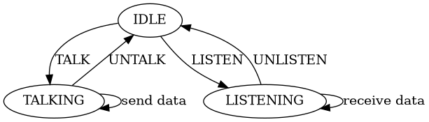
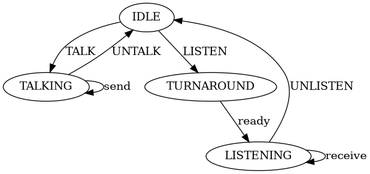
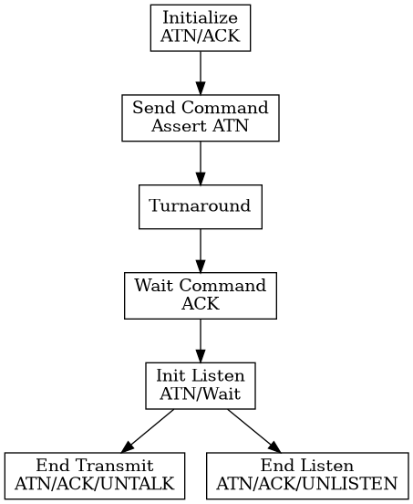

= ASB Protocol Design Notes

== Foundational Influences
Garth Wilson's work has influenced multiple aspects of Aves:

=== Physical Layer Solutions
* VIA shift register timing fixes
* I2C implementation principles 
* SPI interface design patterns

=== Interrupt Handling
* His high-level Forth interrupt approach influencing Kingfisher
* Clean separation of hardware and software concerns
* Efficient interrupt processing

== Physical Layer Specification

=== Physical Characteristics
* Half duplex communication using 65C22 VIA
* System clock (Phi2) requirement: 4MHz minimum
* Maximum data rate: 1Mbps

=== Hardware Implementation
* Pulsed handshake using edge-sensitive CA1/CA2 I/O
* External tristate buffers for I/O direction control
* Clock synchronization via Phi2-clocked latch

=== Network Topology
* Single controller architecture
* Supports up to 15 responder devices
* Each device uniquely addressable

=== Data Transfer
* Byte-by-byte transmission
* Each byte requires handshake acknowledgment
* Self-pacing through ACK mechanism
* No fixed timing requirements between bytes

=== Reliability Features
* Edge-triggered handshaking
* Hardware flow control via ACK
* Automatic speed matching to receiver capabilities
* Robust clock synchronization

== FLAP Data-Link Protocol

=== IEEE488 Command Structure
* LISTEN (0x20 + device) - Assigns device as data receiver
* TALK (0x40 + device) - Assigns device as data transmitter
* UNLISTEN (0x3F) - Releases all devices from listen mode
* UNTALK (0x5F) - Releases current talker

=== Connection Management
==== Establishing Connection
1. Controller sends LISTEN command to target device(s)
2. Controller sends TALK command to source device
3. Data transfer can begin

==== Terminating Connection
1. Controller sends UNLISTEN to release listeners
2. Controller sends UNTALK to release talker
3. Bus returns to idle state

=== Device Addressing
* Device addresses: 0-14 (4 bits)
* Address 15 reserved
* Commands: Upper 2 bits define command type
* Lower 4 bits contain device address

=== Protocol Features
* Clear command structure
* Deterministic bus control
* Multiple listener support
* Single talker at a time

=== Responder Device States
The responder device follows a simple but robust state machine model that ensures reliable communication on the ASB bus.

.State Transitions
[graphviz]
----
digraph responder_states {
    idle [label="IDLE"]
    talking [label="TALKING"]
    listening [label="LISTENING"]

    idle -> talking [label="TALK"]
    idle -> listening [label="LISTEN"]
    
    talking -> talking [label="send data"]
    talking -> idle [label="UNTALK"]
    
    listening -> listening [label="receive data"]
    listening -> idle [label="UNLISTEN"]
}
----

==== State Descriptions
* IDLE
** Default state
** Monitors bus for TALK/LISTEN commands
** Only responds to commands matching its address

* TALKING
** Enabled to transmit data
** Maintains state until UNTALK received
** Controls data flow with handshaking

* LISTENING
** Accepts incoming data
** Maintains state until UNLISTEN received
** Acknowledges received data

==== Transition Rules
* Only one device can be in TALKING state at a time
* Multiple devices can be in LISTENING state
* All state changes initiated by controller
* Device returns to IDLE on bus reset

=== Controller Device States

The controller implements a four-state machine model that manages bus operations and data flow. This design ensures orderly transitions between sending commands, transmitting data, and receiving responses.

.State Transitions
[graphviz]
----
digraph controller_states {
    idle [label="IDLE"]
    talking [label="TALKING"]
    turnaround [label="TURNAROUND"]
    listening [label="LISTENING"]

    idle -> talking [label="TALK"]
    idle -> turnaround [label="LISTEN"]
    
    talking -> talking [label="send"]
    talking -> idle [label="UNTALK"]
    
    turnaround -> listening [label="ready"]
    
    listening -> listening [label="receive"]
    listening -> idle [label="UNLISTEN"]
}
----

==== State Descriptions
* IDLE
** Default bus state
** Ready to initiate commands
** No active transfers

* TALKING
** Controller is sending data
** Maintains state for multiple sends
** Returns to IDLE via UNTALK

* TURNAROUND
** Transitional state between IDLE and LISTENING
** Preparing bus for receive operation
** Transitions to LISTENING when ready

* LISTENING
** Controller receiving data
** Can receive multiple data bytes
** Returns to IDLE via UNLISTEN

==== Transition Rules
* All transfers start from IDLE
* TURNAROUND required before LISTENING
* Self-loops on TALKING/LISTENING for data transfer
* Clean return to IDLE via UNTALK/UNLISTEN

=== Transport Layer Protocol
The transport protocol ensures reliable end-to-end data exchange between devices on the ASB bus. It manages the handshaking sequence, flow control, and connection states required for dependable communication between controller and responder devices.

[graphviz]
----
digraph transport_protocol {
    rankdir=TB;
    node [shape=box];
    
    init [label="Initialize\nATN/ACK"];
    cmd [label="Send Command\nAssert ATN"];
    turn [label="Turnaround"];
    wait [label="Wait Command\nACK"];
    listen [label="Init Listen\nATN/Wait"];
    
    eoi_tx [label="End Transmit\nATN/ACK/UNTALK"];
    eoi_rx [label="End Listen\nATN/ACK/UNLISTEN"];
    
    init -> cmd;
    cmd -> turn;
    turn -> wait;
    wait -> listen;
    
    listen -> eoi_tx;
    listen -> eoi_rx;
}
----
==== Initialisation
1. Send ATN pulse
2. Wait for ACK Pulse

==== Command/Data Transmission
1. Assert ATN (low)
2. Command/Data

==== Turnaround
1. Wait for command acknowledge
2. Initialize listen
3. Send ATN pulse
4. Wait for data

==== End Transmission (EOI)
1. Pulse ATN
2. Wait for ACK
3. Send UNTALK command

==== End Listen (EOI)
1. Pulse ATN
2. Wait for ACK
3. Send UNLISTEN command

==== Protocol Features
* ATN pulse signaling for synchronization
* Handshake acknowledgment required
* Clear state transitions
* Explicit end-of-transmission handling
* Separate paths for transmit/listen completion
