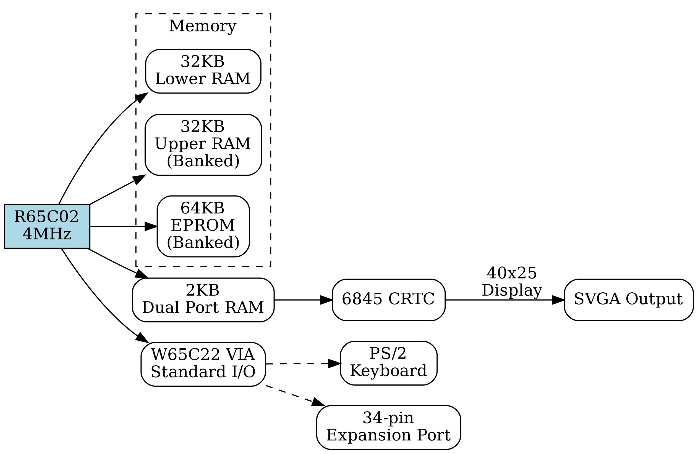
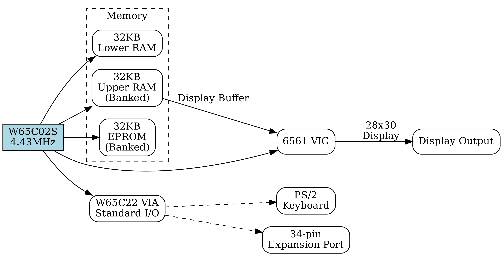

= System Architecture Overview

== Architectural Principles
Before delving into specific technical details, it's important to understand the fundamental design philosophies and architectural decisions that shape the Aves platform. These principles reflect both practical engineering considerations and broader goals for the system's role in modern retrocomputing.

The architecture of Aves represents a careful balance between preserving the elegant simplicity of classic 8-bit systems and incorporating modern design practices. Rather than simply replicating vintage hardware, each aspect of the system has been thoughtfully evaluated and, where appropriate, enhanced to meet contemporary needs while maintaining the spirit of its inspiration.

At the heart of Aves lies Considered Minimalism, where each component serves multiple purposes through clever design rather than brute-force complexity. This approach yields efficient use of resources while maintaining clarity and serviceability. 

The platform embraces Pragmatic Modernization, incorporating contemporary interfaces and manufacturing techniques in ways that preserve the system's accessibility and educational value. This careful integration of modern elements enhances rather than obscures the fundamental simplicity of the design.

Flexible Evolution stands as another cornerstone of the architecture. The system accommodates various processor and memory configurations while maintaining a consistent programming model, allowing it to grow with user needs without compromising its core principles.

The following sections detail how these principles manifest in specific aspects of the system architecture, from processor selection to memory management and I/O subsystems.

== System Architecture
The Aves platform's architectural heritage stems from the remarkable family of Commodore 8-bit and 16-bit computers, drawing particular inspiration from the CBM8096, Commodore 64 and Plus/4 machines. Whilst these classic designs laid the groundwork, Aves refines and modernises their most successful elements into a cohesive and elegant architecture.

At the heart of every Aves system lies a philosophy of considered minimalism, where each component serves multiple purposes through clever design rather than brute-force complexity. This approach manifests most notably in the memory management and I/O subsystems, where time-tested concepts from the Commodore machines have been thoughtfully reimagined.

The memory architecture pays homage to the innovative bank-switching schemes of its forebears. Where the CBM8096 introduced upper memory banking, and the Commodore 64 demonstrated the flexibility of ROM overlay techniques, Aves unifies these concepts into a sophisticated yet straightforward memory management system. This arrangement provides remarkable flexibility whilst maintaining compatibility with traditional software design patterns.

Perhaps the most significant departure from tradition lies in the I/O subsystem. Where Commodore machines typically employed multiple interface adapters—CIAs, PIAs, and various custom chips—Aves consolidates these functions into a carefully orchestrated arrangement centred on the W65C22 VIA. This consolidation does not represent a compromise but rather an elegant solution that reduces complexity whilst expanding capabilities.

The VIA implementation demonstrates the platform's pragmatic approach to modernisation. Through thoughtful programming of this versatile chip, Aves achieves compatibility with contemporary interfaces such as I2C and SPI, whilst also supporting a custom high-speed serial protocol, the Aves Serial Bus (ASB). This bus draws inspiration from the efficiency of Commodore's serial bus architecture whilst eliminating its notorious timing dependencies.

Throughout the system, one finds this pattern of respectful modernisation. The hardware banking mechanisms, whilst more sophisticated than their predecessors, maintain familiar programming paradigms. The interrupt handling system, though more capable than the original Commodore implementations, remains straightforward and predictable. Even the most advanced configurations, supporting the 16-bit W65816 processor, retain compatibility with their 8-bit siblings through carefully considered hardware abstractions.

This architectural philosophy extends to the physical design as well. The circuit board layouts, component selection, and signal routing all reflect a balance between simplicity and capability. Modern manufacturing techniques and components are employed where beneficial, yet the system remains accessible to hobbyist construction and modification, maintaining the spirit of its predecessors.

==== I2C Interface
The I2C interface is implemented in software using PA0 of the VIA for SCL and PA7 for SDA. This arrangement provides optimal bit manipulation capabilities, as testing bit 7 with the BIT instruction will directly affect the processor's N flag for efficient state testing. Both lines require external 4.7kΩ pull-up resistors to VCC to ensure proper signal levels and to meet I2C bus specifications.

The implementation leverages specific characteristics of the 65C02 instruction set. The lines are manipulated using the data direction register to create a pseudo open-drain configuration - setting a pin as input allows it to float high via the pull-up resistor, while setting it as output drives it low. Start conditions are generated by transitioning SDA from high to low while SCL is high, with stop conditions created by the opposite transition. Clock generation employs increment and decrement instructions for precise timing control, while the BIT instruction enables rapid testing of PA7's state through the N flag.

The interface supports standard mode I2C operation at 100 kHz, with timing managed through software delays calibrated to the system clock frequency. Clock stretching is supported through continuous monitoring of the SCL line state, allowing compatibility with slower I2C peripheral devices. Multi-master mode is not supported.

==== SPI Interface
The SPI interface is implemented in firmware, as modes 0 and 3 only. As with the I2C interface the clock; SCK is implemented on PB0, PB1-PB3 contains the device number and is decoded with a 74HC138 decoder to provide 7 device selects ss1-ss7.

MOSI uses PB6 and MISO PB7. 

SPI is output at 5V with inputs at TTL levels SPI memory and IO devices.

==== Aves Serial Bus (ASB)
The Aves serial bus uses the VIA shift register to implement a half duplex serial protocol, that is substantially faster than Commodore's propitiatory Serial bus (frequently incorrectly referred to as IEC). The VIA's CAn lines are used as handshake lines. PA6 is used to determine if the bus is transmitting or receiving

==== PS/2 Keyboard Interface
The PS/2 Keyboard interface is based on Ben Eater's PS/2 keyboard interface design, which uses 74HC595 shift registers. Unlike Ben's implementation, data is read directly from the register's parallel output, freeing up 8 additional I/O lines on the VIA. The interrupt logic remains unchanged, using the VIA's CA1 input to detect incoming data.

==== I/O expansion port 
The I/O expansion port is presented on a 34 pin right angle male header, it comprises the 8 x data lines, 12 x address lines, 4 x select lines, RnW, Phi2, RESETb, IRQb, power and gnd.

.Expansion Port Pinout
[%header,rows="2,3"]
|===
|Pin No|Description

|1,2
|Ground

|3-11
|9 bit, Address Bus, A0-A8

|12
|RnW signal 1=read, 0=write

|13
|Phi2 clock, represents phase 2 of the system clock, which is used to synchronise all CPU operations

|14-21
|8 bit Data bus D0-D7

|22
|RnW

|23
|Phi2

|24
|XIOb, Expansion Port Select, Active low

|25
|IRQb, Interrupt request, active low

|26
|NMIb, Interrupt request, active low

|27
|RESb, Reset signal, active low

|28
|SDA, I2C Bi directional data line

|29
|SCL, I2C Bi directional Clock line

|30
|NC

|31,32
|+5V Supply

|33,34
|Ground
|===

[bibliography]
== References

* [[[W65c02,1]]] Western Design Center, "W65C02S 8-bit Microprocessor", Publication 651xx-14 Rev. 8.0
* [[[W65816,2]]] Western Design Center, "W65C816S 16-bit Microprocessor", Publication 655xx-16 Rev. 10.0
* [[[W65c22,3]]] Western Design Center, "W65C22S Versatile Interface Adapter", Publication 652xx-14 Rev. 4.0
* [[[necv25,4]]] NEC Electronics, "V25 16-bit Single Chip CMOS Microcomputer", Document ID: S11988EJ3V0UM00
* [[[as6c1008,5]]] Alliance Memory, "AS6C1008 128KB x 8 Low Power CMOS SRAM", Rev. 1.0
* [[[eater,6]]] Ben Eater, "Building a 6502 computer", https://eater.net/6502

[NOTE]
--
Current versions of these datasheets may be obtained from:

* Western Design Center documents: Available from manufacturer website or preserved copies in Aves repository
* NEC/Renesas documents: Available from Renesas historical documentation archive
* Memory datasheets: Available from current manufacturers of compatible devices

The specific versions used in developing Aves are preserved in the project repository under `/doc/datasheets/` to ensure reproducible builds and consistent reference.
--

* [[[mc68hc000,7]]] Motorola, "MC68HC000 HCMOS Microprocessor", ADI1024R1
* [[[z16c01,8]]] Zilog, "Z16C01/02 CMOS CPU with MMU", DC2144-01
* [[[v35,9]]] NEC Electronics, "V35 16-bit Single-Chip CMOS Microcomputer User's Manual", Document ID: S11989EJ3V0UM00

[NOTE]
--
The CPU timing specifications can be found in:
* W65C02S/W65C816S - References [1] and [2]
* V25/V35 - References [4] and [9]
* MC68HC000 - Reference [7]
* Z16C01 - Reference [8]
--

== Aves 8-bit Range
The Aves 8-bit family consists of five primary models, each designed to serve different use cases while maintaining compatibility and adhering to the platform's core principles.

=== Aves Standard I/O
The Aves platform uses a standardized I/O configuration across all models, built around the W65C22 VIA. This provides a consistent interface architecture, simplifying both hardware and software development while ensuring compatibility across the range.

.Standard I/O Specifications
[%header, cols="2,3"]
|===
|Interface|Specification

|I2C
|Software implementation using W6522 GPIO and Timers

|SPI
|Software implementation using W6522 GPIO and Timers

|ASB
|Implementation using 65C22 shift register

|GPIO
|Uses 2 x W6522 GPIO lines

|Keyboard
|PS/2 Keyboard Interface

|Expansion
|34-pin IO expansion port
|===

.Standard I/O Architecture
image::standard-io.png[Aves Standard I/O]

=== Aves Sparrow
The Sparrow represents the Commodore PET re-imagined. It's specification has been adapted to integrate with modern computer monitors and keyboards but offers 40 column by 25 row display, via and SVGA port.

.Sparrow Specifications
[%header, cols="2,3"]
|===
|Attribute|Detail

|CPU
|R65C02 @ 4MHz

|Lower RAM
|32KB Static

|Upper RAM
|32KB Static (Banked)

|ROM
|64KB EPROM (Banked)

|Display Buffer
|2KB Dual Port RAM 

|Display Controller
|6845 CRTC

|I/O Ports
|<<Standard I/O Specification>>

|===

.Sparrow Architecture

=== Aves Dunnock
The Dunnock represents the Commodore 8000 series re-imagined. It's specification has been adapted to integrate with modern computer monitors and keyboards but offers 80 column by 25 row display, via an SVGA port.

.Dunnock Specifications
[%header, cols="2,3"]
|===
|Attribute|Detail

|CPU
|R65C02 @ 4MHz

|Lower RAM
|32KB Static

|Upper RAM
|32KB Static (Banked)

|ROM
|32KB Flash (Banked)

|Display Buffer
|4KB Dual Port RAM

|Display Controller
|6845 CRTC

|I/O Ports
|<<Standard I/O Specification>>

|===

.Dunnock Architecture

=== Aves Robin
The Robin represents the Commodore VIC-20 re-imagined. It's specification includes an original 6561 VIC chip with the Aves standard memory and IO configuration. The display area is increased to 28 columns by 30 rows

.Robin Specifications
[%header, cols="2,3"]
|===
|Attribute|Detail

|CPU
|W65C02S @ 4.43MHz

|Lower RAM
|32KB Static

|Upper RAM
|32KB Static (Banked)

|ROM
|32KB EPROM (Banked)

|Display Controller
|6561 VIC

|Display Buffer
|Uses Lower part of Upper RAM

|I/O Ports
|<<Standard I/O Specification>>

|===

.Robin Architecture

=== Aves Blackbird
The Blackbird represents a bridge between the 8-bit and 16-bit worlds, reimagining the Commodore 64's architecture with the W65C816S processor. While maintaining compatibility with 6502 code through its 8-bit emulation mode, it can switch to full 16-bit operation for enhanced performance. The VIC-II display controller provides C64-compatible graphics capabilities while operating at 9 times the original C-64 clock speed (8.86MHz vs 0.98MHz) enabling enhanced video operation when paired with the 16-bit CPU capabilities.

.Blackbird Specifications
[%header, cols="2,3"]
|===
|Attribute|Detail

|CPU
|W65C816 @ 7.88MHz

|RAM
|128KB RAM

|ROM
|128KB Flash

|Display Controller
|6569 VIC II

|Display Buffer
|Uses address $08000-0C000 of RAM 
|I/O Ports
|<<Standard I/O Specification>>

|===

.Blackbird Architecture

=== Aves Starling
The Starling is a compact 8-bit computer built around the W65C02S processor running at 8.86MHz. It features a flexible memory architecture with 32KB of direct-access RAM complemented by 96KB of banked RAM and 128KB of banked Flash storage. The system uses the 8530 TED display controller for video output. I/O capabilities are provided through a W65C22 VIA, offering both industry-standard interfaces (I2C, SPI) and the custom Aves Serial Bus (ASB) implemented using the VIA's shift register. The system includes 6 GPIO lines for general-purpose interfacing, PS/2 keyboard input, and future expansion possibilities through its 34-pin I/O port.

.Starling Specifications
* Processor: W65C02S @ 4.43MHz
* Memory:
** 32KB Lower RAM
** 32KB Upper RAM (Banked)
** 64KB EPROM (Banked)
* 8530 TED display controller
|I/O Ports
|<<Standard I/O Specification>>

=== Aves Fieldfare
The Fieldfare represents the ultimate expression of the Aves 8-bit family, drawing inspiration from both the Commodore 128 and the unreleased P-500. It features a sophisticated multi-processor architecture with three loosely coupled subsystems.

.Fieldfare Specifications
|===
|Attribute|Detail

|Main CPU
|W65C816S @ 10MHz

|Lower RAM
|512KB 

|Upper RAM
|512KB 

|Shadow RAM
|128KB

|ROM
|128KKB Flash

|===

.IO Coprocessor Specifications
|===
|Attribute|Detail

|CPU
|R65C02 @ 4MHz

|RAM
|32KB 

|ROM
|8KB ROM

|Inter CPU - Dual port RAM
|2KB

|Dunnock Display Interface
|<<Dunnock Specifications>>

|I/O Ports
|<<Standard I/O Specification>>
|===

* Video Subsystem:
** 
** 32KB dedicated Lower RAM
** 8KB EPROM
** 2KB Dual-Port RAM fixed in address space
** 6569 VIC-II display controller
** Direct address connection
** Independent video processing
** Hardware sprite management
** Multiple display modes

* Main Graphic display
** MC6845 CRTC Display controller 
** 800 x 600 Mono Bitmap display
** 400 x 300 Colour Bitmap Display
** 32KB x 16 bit display RAM

* Inter-Processor Communication:
** Main-I/O: 2KB Dual-Port RAM
** Main-Video: 2KB Dual-Port RAM
** Hardware address decoding for DP RAM selection
** Fixed memory mapping for communication areas

* Memory Architecture:
** 24-bit address bus supporting 16MB address space (Only 2MB Used)
** Block 0 (000000-07FFFF):
*** 8 repetitions of base segment
*** Each 64KB segment contains:
**** 8K RAM
**** Aves Standard I/O
**** 8K ROM
** Block 1 (080000-0FFFFF):
*** 512K RAM
** Block 2 (100000-17FFFF):
*** 512K RAM
** Block 3 (180000-1FFFFF):
*** 4 repetitions of 128K segment
*** Each segment contains 128K Flash with Shadow RAM
** No MMU - direct memory access throughout

* Expansion:
** Primary 34-pin IO expansion port
** Secondary high-speed expansion bus
** Enhanced interrupt handling capabilities
** Direct memory access port

* Compatibility:
** Native 16-bit mode
** 8-bit compatibility mode
** Support for both 6502, 65C02 and 65816 code execution

== Aves Peripherals

== Aves 16-bit Models

== Foundational Influences
Garth Wilson's work has influenced multiple aspects of Aves:

=== Physical Layer Solutions
* VIA shift register timing fixes
* I2C implementation principles 
* SPI interface design patterns

=== Interrupt Handling
* His high-level Forth interrupt approach influencing Kingfisher
* Clean separation of hardware and software concerns
* Efficient interrupt processing
